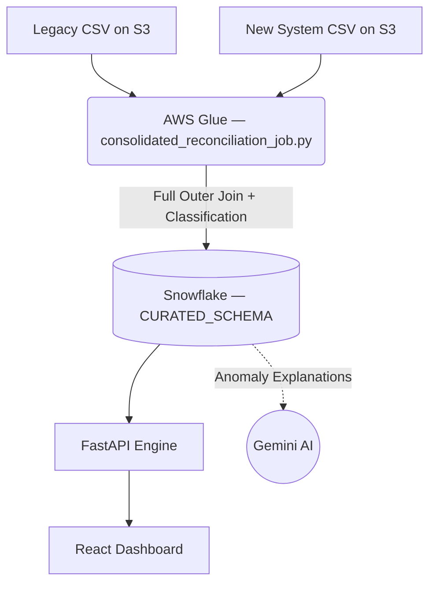

# Validata — Data Validation & Reconciliation Engine

Validata is an enterprise-grade Data Reliability and Ledger Reconciliation platform. It continuously validates and audit-checks transaction ledger migrations between legacy databases and new core ledgers.

The engine leverages an AWS-native PySpark pipeline via **AWS Glue** and **AWS S3**, loads curated discrepancies (amount drift, state mismatch, missing records) into **Snowflake**, automatically generates AI-driven root cause explanations using **Google Gemini**, and visualizes them on an interactive React dashboard.

---

## 🏗️ System Architecture & Data Flow



---

## ☁️ Infrastructure as Code (Terraform)

The cloud infrastructure is fully managed via Terraform (`infra/terraform/`).
Running `terraform apply` provisions the following resources automatically:

| Resource | Details |
|---|---|
| `aws_s3_bucket` | `validata-datalake-dev` — versioned, AES-256 encrypted, no public access |
| `snowflake_database` | `ValiData_DB` |
| `snowflake_warehouse` | `COMPUTE_WH` — X-Small, auto-suspends after 60s idle |
| `snowflake_schema` | `RAW_SCHEMA` + `CURATED_SCHEMA` |
| `snowflake_user` | `VALIDATA_SVC_USER` — dedicated ETL service account |
| Role Grants | DB + Warehouse USAGE granted to service account |

```bash
cd infra/terraform
terraform init
terraform plan    # preview changes
terraform apply   # provision infrastructure
```

> See `infra/terraform/terraform.tfvars.example` — fill in your credentials before running.

---

## 🔄 ETL Pipeline — AWS Glue PySpark Job

The single consolidated job at `backend/notebooks/consolidated_reconciliation_job.py` handles the entire pipeline in one Glue run:

1. **Extract** — Reads raw transaction CSVs from `s3://validata-datalake/raw/legacy_system/` and `s3://validata-datalake/raw/new_system/`
2. **Transform** — Renames columns and prepares both DataFrames for a collision-free join
3. **Reconcile** — Full outer join on `txn_id`, computes `amount_diff` and `amount_diff_pct`
4. **Classify** — Tags every record with a validation status:
   - `MATCH` — amounts, currency, and status are identical
   - `AMOUNT_MISMATCH` — amount drift > 0.1%
   - `STATUS_MISMATCH` — posting status differs between systems
   - `MISSING` — present in legacy, absent from new system
   - `PHANTOM` — present in new system, absent from legacy
5. **Load** — Writes final results directly to Snowflake `CURATED_SCHEMA.VALIDATION_RESULTS`

---

## 🎯 Discrepancy Classification Model

| Status | Description |
|---|---|
| `MATCH` | Identical records — amount, currency, and posting status align |
| `AMOUNT_MISMATCH` | Present in both ledgers but currency/amount fields drift |
| `STATUS_MISMATCH` | Exists in both but transaction status differs (e.g. `PENDING` vs `SETTLED`) |
| `MISSING` | In the legacy ledger but absent from the new system |
| `PHANTOM` | In the new system but absent from the legacy ledger |

---

## 📸 Application Dashboards

### 1. Dashboard Overview


### 2. Search & Reconciliation Results


### 3. AI Copilot Panel


### 4. AI Audit Report


---

## 📂 Repository Structure

```
Validata — Data Validation Engine/
├── backend/
│   ├── database/              # Snowflake DDL schemas & setup SQL
│   ├── notebooks/
│   │   └── consolidated_reconciliation_job.py  # AWS Glue PySpark ETL job
│   ├── scripts/               # Local reconciliation simulator
│   ├── src/
│   │   ├── api/               # FastAPI endpoints & routers
│   │   └── engine/            # AI observability hooks
│   ├── tests/                 # pytest unit & integration tests
│   ├── main.py                # FastAPI server entrypoint
│   └── requirements.txt       # Python dependencies
├── frontend/                  # React / Vite dashboard
│   ├── src/                   # Components, pages, API services
│   └── vite.config.ts         # Vite dev server & proxy config
├── infra/
│   └── terraform/             # IaC — S3, Snowflake DB/WH/Schemas/User
├── .github/
│   └── workflows/
│       └── pytest.yml         # CI — runs backend test suite on every push
├── sample_data/               # Test transaction CSV files
├── .env.example               # Environment variable template
├── docker-compose.yml         # Container definitions
└── README.md
```

---

## 🚀 Local Development Setup

### 1. Configure Environment
```bash
cp .env.example .env
# Fill in: SNOWFLAKE_* credentials and GEMINI_API_KEY
```

### 2. Start Backend API
```powershell
cd backend
python -m venv venv
venv\Scripts\Activate.ps1
pip install -r requirements.txt
python -m uvicorn main:app --reload --port 8000
```
Verify: `http://localhost:8000/health`

### 3. Start Frontend Dashboard
```powershell
cd frontend
npm install
npm run dev
# Runs on http://localhost:5173 (proxied to backend :8000)
```

### 4. Run Local Reconciliation (without AWS/PySpark)
```powershell
cd backend
venv\Scripts\Activate.ps1

# Full pipeline (Snowflake + Gemini AI):
python scripts/run_reconciliation.py --legacy ../sample_data/test_legacy_transactions.csv --new ../sample_data/test_new_system_transactions.csv

# Offline / mock mode (no cloud calls):
python scripts/run_reconciliation.py --local-only --legacy ../sample_data/test_legacy_transactions.csv --new ../sample_data/test_new_system_transactions.csv
```

---

## 🧪 Testing & CI

Tests are written with **pytest** and run automatically on every push via GitHub Actions (`.github/workflows/pytest.yml`).

```powershell
# Run locally
cd backend
venv\Scripts\Activate.ps1
pytest tests/
```

---

## 🛠️ Tech Stack

| Layer | Technology |
|---|---|
| ETL / Data Pipeline | AWS Glue, PySpark, AWS S3 |
| Data Warehouse | Snowflake |
| IaC | Terraform (AWS + Snowflake providers) |
| Backend API | Python, FastAPI, Uvicorn |
| AI / LLM | Google Gemini API |
| Frontend | React, Vite, TypeScript |
| CI | GitHub Actions + pytest |
