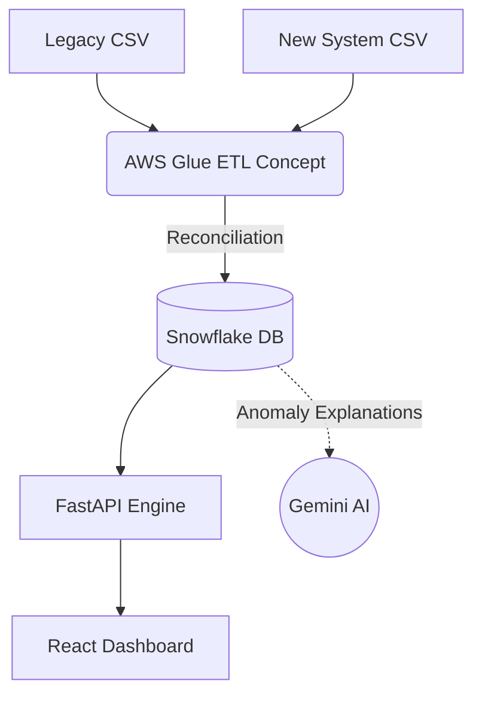

# Validata — Data Validation & Reconciliation Engine

Validata is an enterprise-grade Data Reliability and Ledger Reconciliation platform. It continuously validates and audit-checks transaction ledger migrations between legacy databases and new core ledgers.

The engine leverages an AWS-native PySpark data pipeline via **AWS Glue** and **AWS S3**, loads curated discrepancies (e.g., amount drift, state mismatch, missing records) into **Snowflake**, automatically generates AI-driven root cause explanations using **Google Gemini**, and visualizes them on an interactive dashboard.

---

## 🏗️ System Architecture & Data Flow



---

## 📓 Conceptual Cloud Architecture (AWS & PySpark)

While the core reconciliation engine is designed to run locally or on a standard server, I also designed a **conceptual cloud architecture** to demonstrate how this pipeline would scale in a production enterprise environment. 

The `backend/notebooks/` directory contains conceptual PySpark notebooks that mirror the local Python script's logic, translating it for **AWS Glue** serverless execution:

* **`01_extract_raw_data.py`** & **`02_transform_clean_standardize.py`**: Concepts for reading from S3, applying schema enforcement, and standardizing data.
* **`03_deduplicate_validate_schema.py`** & **`04_validation_engine.py`**: Concepts for distributed full-outer joins and data deduplication using PySpark.
* **`05_load_to_snowflake.py`** & **`06_ai_anomaly_explanation.py`**: Concepts for bulk ingestion into Snowflake and orchestrating Gemini AI API calls at scale.

*(Note: For demonstration and interview purposes, the pipeline is executed via the Local Simulation Tool rather than spinning up live AWS Glue clusters).*

---

## 📸 Application Dashboards & Observability

Here are key screenshots of the Validata Control Center:

### 1. Dashboard Overview


### 2. Search & Reconciliation Results


### 3. AI Copilot Panel


### 4. AI Audit Report


---

## 🎯 Discrepancy Classification Model

The reconciliation engine flags every ledger pair into one of five categories:
* **`MATCH`**: Identical records, transactions match in amount, currency, and posting status.
* **`AMOUNT_MISMATCH`**: Transaction is present in both ledgers, but currency/amount fields drift.
* **`STATUS_MISMATCH`**: Transaction exists in both ledgers, but transaction statuses mismatch (e.g. `PENDING` vs `SETTLED`).
* **`MISSING`**: Present in the legacy ledger but absent from the new system.
* **`PHANTOM`**: Present in the new system but absent from the legacy ledger.

---

## 📂 Repository Structure

The project is structured as a clean, consolidated monorepo:

```bash
Validata — Data Validation Engine/
├── backend/                   # 🐍 Python / FastAPI Service
│   ├── database/              # SQL setups and Snowflake DDL schemas
│   ├── notebooks/             # AWS Glue PySpark ETL / AI notebooks
│   ├── runbooks/              # Compliance operations SOPs
│   ├── scripts/               # Local reconciliation simulator script
│   ├── src/                   # Core Python logic (api, engine)
│   │   ├── api/               # Unified FastAPI endpoints & routers
│   │   └── engine/            # AI Observability engine hooks
│   ├── tests/                 # API unit & integration test suite
│   ├── venv/                  # Local python virtual environment
│   ├── main.py                # FastAPI server entrypoint (proxied to src/api/app.py)
│   └── requirements.txt       # Frozen direct dependencies
├── frontend/                  # ⚛️ React / Vite / Tailwind UI
│   ├── src/                   # Components, pages, and API services
│   ├── package.json           # Node dependencies
│   └── vite.config.ts         # Vite server & proxy configurations
├── .env                       # Combined environment secrets
├── docker-compose.yml         # Container definitions
└── README.md                  # System documentation
```

---

## 🚀 Installation, Run Flows & Local Development

### 1. Configure Environments
Copy the environment template file at the root:
```bash
cp .env.example .env
```
Provide your **Snowflake Credentials** and **`GEMINI_API_KEY`** in the `.env` file.

### 2. Execution Flows (Production vs. Local)

#### A. Production Run Flow
In production, the data processing pipeline is serverless and orchestrated inside AWS:
1. **Raw Source Logs**: Transactional CSV files are written to the landing S3 directory (`s3://validata-datalake/raw/`).
2. **AWS Glue ETL**: Run PySpark Glue jobs `01_extract_raw_data.py` through `04_validation_engine.py` to extract, clean, deduplicate, and perform the full outer-join reconciliation.
3. **Snowflake Ingestion**: Run `05_load_to_snowflake.py` to bulk load the curated parquets into the warehouse `VALIDATION_RESULTS` table.
4. **AI Observability**: Run `06_ai_anomaly_explanation.py` to trigger LLM analysis and save explanations back into Snowflake.

#### B. Local Simulation Flow (Reconciliation Script Tool)
To test reconciliation, Snowflake uploads, and AI analysis locally without needing PySpark or AWS, use the local reconciliation script:
```powershell
cd backend
# 1. Activate virtual environment
.\venv\Scripts\Activate.ps1

# 2. Run the local reconciliation pipeline tool
# To run full pipeline with default test data (Upload to Snowflake + Google Gemini AI):
python scripts/run_reconciliation.py --legacy ../sample_data/test_legacy_transactions.csv --new ../sample_data/test_new_system_transactions.csv

# OR to run in offline / mock mode:
python scripts/run_reconciliation.py --local-only --legacy ../sample_data/test_legacy_transactions.csv --new ../sample_data/test_new_system_transactions.csv

# OR to test custom files offline:
python scripts/run_reconciliation.py --legacy path/to/legacy.csv --new path/to/new.csv --local-only
```
*This tool cleans and standardizes data fields, reconciles records via a full outer-join, and either pushes them to Snowflake + Gemini or exports local CSV and Markdown reports (under `sample_data/`).*

### 3. Start the Backend API
Navigate to the `backend/` folder, activate the virtual environment, install requirements, and boot up the server:
```powershell
cd backend
# Create environment (if not already done)
python -m venv venv
# Activate environment
venv\Scripts\Activate.ps1
# Install dependencies
pip install -r requirements.txt
# Run the FastAPI server (Port 8000)
python -m uvicorn main:app --reload --port 8000
```
Verify backend health: `http://localhost:8000/health`.

### 4. Start the Frontend Dashboard
Navigate to the `frontend/` folder, install Node dependencies, and run the Vite dev server:
```powershell
cd frontend
# Install Node modules
npm install
# Run the development server (Port 5173 with proxy to 8000)
npm run dev
```


---

## 🧪 Testing and Quality Control

Unit and API validation tests are isolated within the backend framework and can be run using the local virtual environment:

```powershell
# Run from workspace root using backend venv
backend\venv\Scripts\python.exe -m pytest backend\tests\
```
