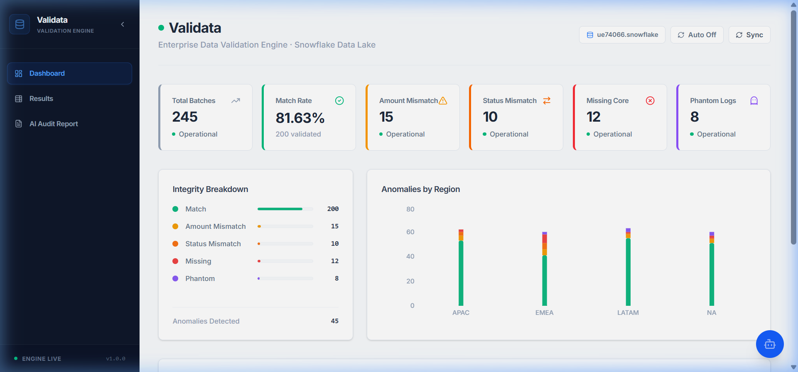
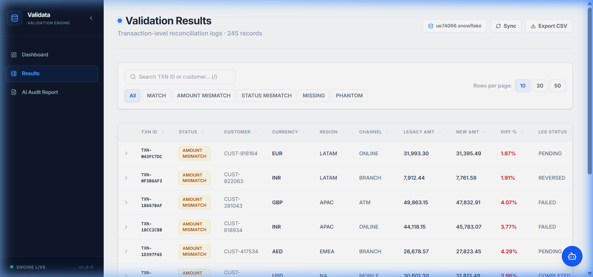
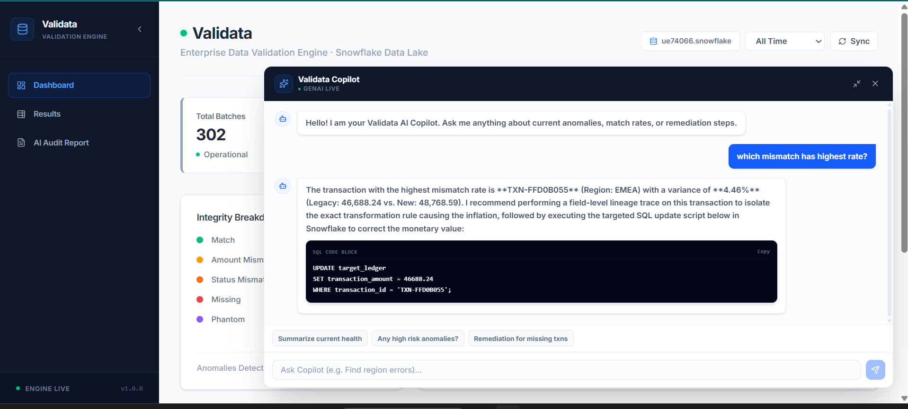
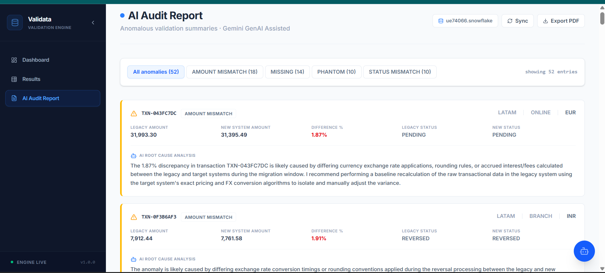

# Validata — Data Validation & Reconciliation Engine

Validata is an enterprise-grade Data Reliability and Ledger Reconciliation platform. It continuously validates and audit-checks transaction ledger migrations between legacy databases and new core ledgers. 

The engine processes transaction data in **Snowflake**, automatically highlights discrepancies (e.g., amount drift, state mismatch, missing records), explains root causes using **Google Gemini LLM**, and provides an interactive control center.

---

## 🏗️ System Architecture & Data Flow

```text
  [ Legacy Ledger ]           [ New System Ledger ]
         │                              │
         └──────────────┬───────────────┘
                        │ Ingestion (simulate_transactions)
                        v
         ┌──────────────────────────────┐
         │     Snowflake Data Lake      │
         │  (ValiData_DB.CURATED_SCHEMA)│
         └──────────────┬───────────────┘
                        │
                        │ SQL Queries
                        v
   +─────────────────────────────────────────+
   │        FastAPI Backend Engine           │
   │  - Reconciles & classifies transactions │
   │  - Queries metrics, trends, anomalies   │
   │  - Analyzes root causes via Gemini 3.6  │
   +────────────────────┬────────────────────+
                        │
            JSON REST   │   Websocket
               APIs     │     Chat
                        v
   +─────────────────────────────────────────+
   │     Vite + React Dashboard Client       │
   │  - Monochromatic Charcoal & Cobalt UI   │
   │  - Live status indicators & KPI trends  │
   │  - Search, Filter & Audit PDF export    │
   │  - Conversational AI Copilot Chat panel │
   +─────────────────────────────────────────+
```

---

## 📸 Application Dashboards & Observability

Here are key screenshots of the Validata Control Center:

### 1. Dashboard Overview


### 2. Search & Reconciliation Results


### 3. AI Copilot Panel


### 4. AI Audit Report


---

## 🎯 Discrepancy Classification Model

The reconciliation engine flags every ledger pair into one of five categories:
* **`MATCH`**: Identical records, transactions match in amount, currency, and posting status.
* **`AMOUNT_MISMATCH`**: Transaction is present in both ledgers, but currency/amount fields drift.
* **`STATUS_MISMATCH`**: Transaction exists in both ledgers, but transaction statuses mismatch (e.g. `PENDING` vs `SETTLED`).
* **`MISSING`**: Present in the legacy ledger but absent from the new system.
* **`PHANTOM`**: Present in the new system but absent from the legacy ledger.

---

## 📂 Repository Structure

The project is structured as a clean, consolidated monorepo:

```bash
Validata — Data Validation Engine/
├── backend/                   # 🐍 Python / FastAPI Service
│   ├── config/                # YAML Data Contract schemas
│   ├── data/                  # Ingestion temp directories
│   ├── database/              # SQL setups and Snowflake schemas
│   ├── notebooks/             # Data exploration logs
│   ├── runbooks/              # Compliance operations SOPs
│   ├── scripts/               # Transaction simulator scripts
│   ├── src/                   # Core Python logic (db, engine, services, utils)
│   ├── tests/                 # Unit & integration test suites
│   ├── venv/                  # Local python virtual environment
│   ├── main.py                # FastAPI server entrypoint
│   └── requirements.txt       # Frozen direct dependencies
├── frontend/                  # ⚛️ React / Vite / Tailwind UI
│   ├── src/                   # Components, pages, and context
│   ├── package.json           # Node dependencies
│   └── vite.config.ts         # Vite server & proxy configurations
├── .env                       # Combined environment secrets
├── docker-compose.yml         # Container definitions
└── README.md                  # System documentation
```

---

## 🚀 Installation & Local Development

### 1. Configure Environments
Copy the environment template file at the root:
```bash
cp .env.example .env
```
Provide your **Snowflake Credentials** and **`GEMINI_API_KEY`** in the `.env` file.

### 2. Start the Backend API
Navigate to the `backend/` folder, activate the virtual environment, install requirements, and boot up the server:
```powershell
cd backend
# Create environment (if not already done)
python -m venv venv
# Activate environment
venv\Scripts\Activate.ps1
# Install dependencies
pip install -r requirements.txt
# Run the FastAPI server (Port 8000)
python -m uvicorn main:app --reload --port 8000
```
Verify backend health: `http://localhost:8000/health`.

### 3. Start the Frontend Dashboard
Navigate to the `frontend/` folder, install Node dependencies, and run the Vite dev server:
```powershell
cd frontend
# Install Node modules
npm install
# Run the development server (Port 5173 with proxy to 8000)
npm run dev
```

---

## 🧪 Testing and Quality Control

Unit and API validation tests are isolated within the backend framework and can be run using the local virtual environment:

```powershell
# Run from workspace root using backend venv
backend\venv\Scripts\python.exe -m pytest backend\tests\
```
